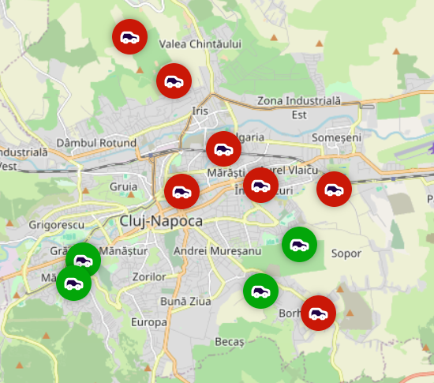
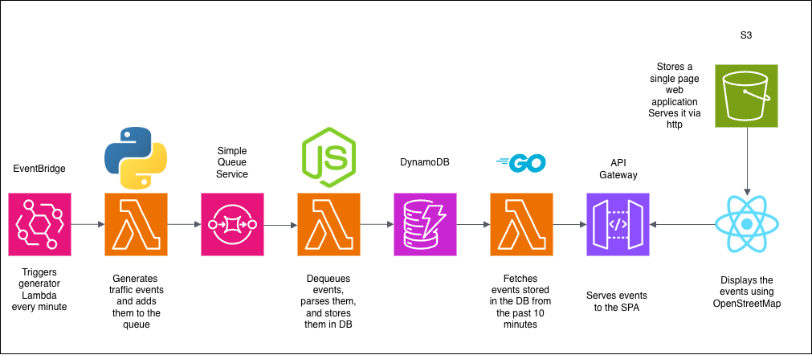

# Mock traffic reports cloud pipeline

### exterra is a cloud app running several different AWS services to generate, process, and visualize traffic data in Cluj-Napoca, Romania

### 3 lambdas are responsible for:
#### - Generating data and enqueuing it in SQS
#### - Pulling data from SQS and storing it in DynamoDB
#### - Fetching recent data from DynamoDB and serving it to the front end via API Gateway

### The Dynamo DB stores records sorted by timestamp, allowing efficient scans based on timestamp

### The front end is a single page React application hosted and served by an S3 bucket

### Eventbridge is used to trigger the generator lambda on a schedule
#### if you have the proper permissions, you might eb able to trigger it too by running
` .\start-generator.sh `
#### Just don't forget to stop it by running 
` .\stop-generator.sh `
#### :P

### Future improvements:
#### - Data security: we might want to restrict traffic through the API Gateway
#### - API extensibility: we might consider allowing the front end to select a custom time range for events
